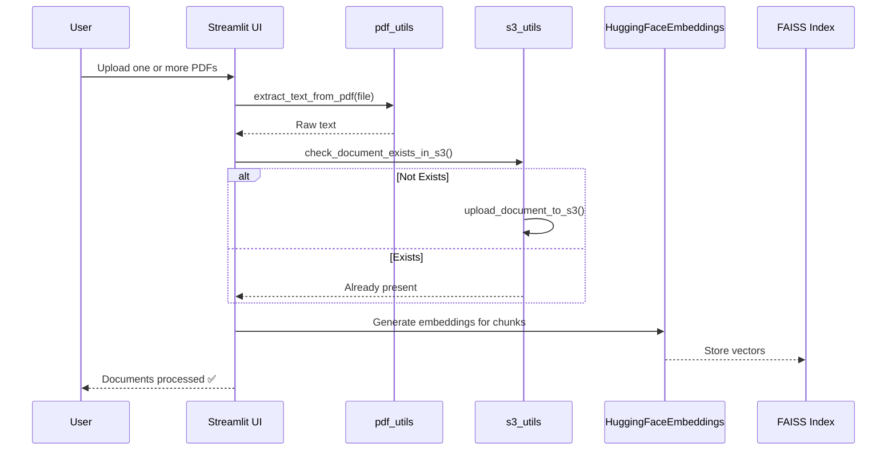
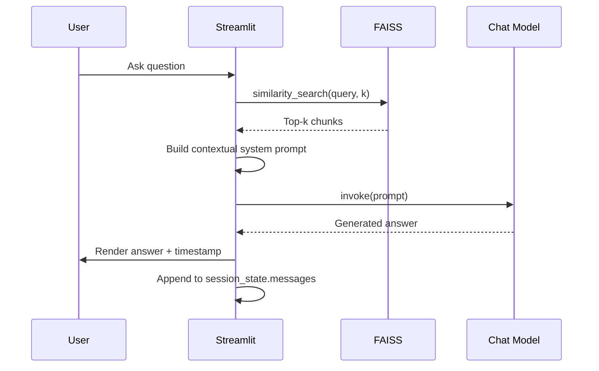
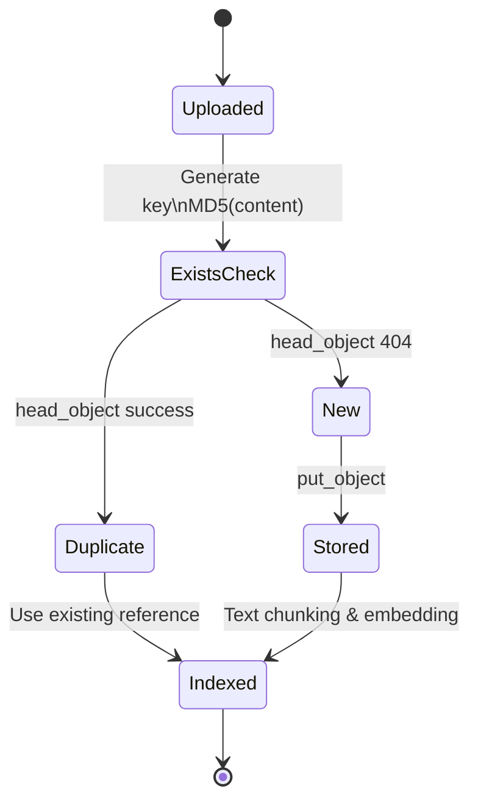
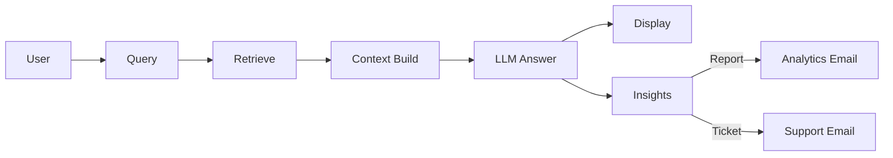
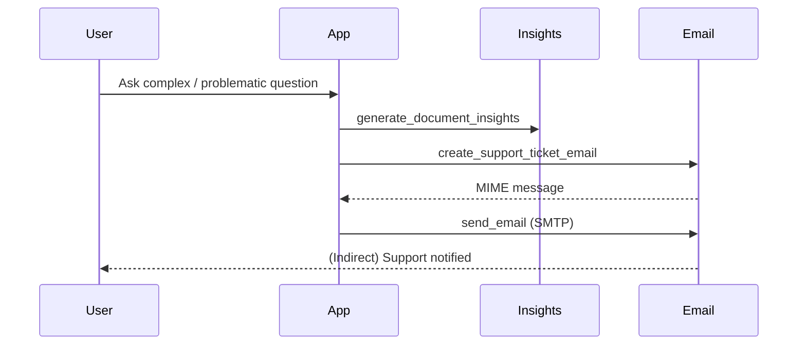

# MediChat Pro – Updated Architecture (Extended Version)

This document elaborates the evolved architecture after adding email analytics, support ticketing, and S3 document management.

---
## 1. Component Overview

| Layer | Components | Purpose |
|-------|------------|---------|
| UI / Presentation | `main.py`, `ui.pdf_uploader()` | Streamlit chat interface & document upload sidebar |
| Ingestion & Storage | `pdf_utils.extract_text_from_pdf`, `s3_utils.*` | Extract text from PDFs, optional persistence to S3 bucket |
| Processing | Chunking (`RecursiveCharacterTextSplitter`), embeddings (`HuggingFaceEmbeddings`), FAISS index | Prepares document knowledge base for retrieval |
| Retrieval | `vectorstore_utils.retrive_relevant_docs` | Finds top-k semantically similar chunks |
| Reasoning / LLM | `chat_utils.get_chat_model`, `ask_chat_model` | Generates contextual answers using retrieved knowledge |
| Analytics & Reporting | `email_utils.generate_document_insights`, email builders | Captures metadata (keywords, coverage, response time) and emails summaries/support tickets |
| Configuration | `config.py` | Centralizes model endpoints, email & API credentials |
| Session State | Streamlit `st.session_state` | Chat history, vector store, model cache |

---
## 2. High-Level System Flow

```mermaid
flowchart TD
    subgraph Upload & Persistence
        U[User Upload PDFs] --> UP[pdf_uploader]
        UP --> EX[Extract Text\n(pdf_utils)]
        EX --> DEC{S3 Enabled?}
        DEC -- Yes --> S3UP[Check/Upload to S3\n(s3_utils)]
        DEC -- No --> SKIP[Skip S3]
        S3UP --> TXT[Collected Raw Text]
        SKIP --> TXT
    end

    TXT --> CH[Chunk & Overlap]
    CH --> EM[Embed Chunks\nHuggingFaceEmbeddings]
    EM --> VS[FAISS Index]

    subgraph Chat Loop
        Q[User Query] --> RET[Similarity Search\nTop-k]
        VS --> RET
        RET --> CTX[Assemble Context]
        CTX --> PROMPT[LLM Prompt]
        PROMPT --> LLM[Chat Model]
        LLM --> RESP[Answer]
        RESP --> HIST[Chat History]
        HIST --> Q
    end

    RESP --> ANA[Generate Insights\n(email_utils)]
    ANA --> MAIL{Email Requested?}
    MAIL -- Analytics --> RPT[Send Medical Report Email]
    MAIL -- Support Ticket --> TKT[Send Support Ticket]
```

---
## 3. Detailed Sequence: Document Ingestion & Indexing



---
## 4. Detailed Sequence: Retrieval-Augmented Chat



---
## 5. Email Analytics & Support Ticket Flow

```mermaid
flowchart LR
    Q[User Query] --> A[LLM Answer]
    A --> R[Relevant Chunks]
    R --> I[Insights Generator\n(generate_document_insights)]
    I --> DEC{Email Type?}
    DEC -- Medical Analytics --> M[create_medical_analytics_email]
    DEC -- Support Ticket --> S[create_support_ticket_email]
    M --> SMTP[send_email]
    S --> SMTP
    SMTP --> OK[Delivery / Error]
```

### Insights Captured
| Field | Description |
|-------|------------|
| relevant_docs_count | Number of retrieved chunks used |
| confidence_score | Heuristic from keywords + response length |
| response_time | Latency bucket from question to answer |
| query_complexity | Simple / Medium / Complex (token heuristic) |
| medical_keywords | Extracted domain terms from query/answer |
| document_coverage | Qualitative summary of breadth |

---
## 6. S3 Document Lifecycle



---
## 7. Key Modules & Responsibilities

| Module | Responsibility | Notes |
|--------|---------------|-------|
| `app/pdf_utils.py` | PDF to raw text | Add future OCR fallback for scanned docs |
| `app/s3_utils.py` | Upload, list, deduplicate, download | Uses content hash for idempotency |
| `app/vectorstore_utils.py` | Embedding + FAISS operations | Currently in-memory only |
| `app/chat_utils.py` | Chat model wrapper | Thin abstraction; extend for streaming |
| `app/email_utils.py` | Analytics + HTML/text email builders | Two email types: report & ticket |
| `app/config.py` | Central config & secrets | Email credentials currently in plain env vars |
| `main.py` | Orchestrates UI + stateful loop | Single-process Streamlit runtime |

---
## 8. Extensibility Hooks

| Enhancement | Integration Point | Strategy |
|-------------|------------------|----------|
| Persistent FAISS | `create_faiss_index` | Use `FAISS.save_local()` / reload on startup |
| Source Citations | Retrieval chain | Keep (chunk_text, source_id) metadata |
| Streaming Answers | `ask_chat_model` | Swap `.invoke` with streaming iterator |
| Feedback Scoring | Chat loop | Collect thumbs & store relevance scores |
| Doc Versioning | S3 key scheme | Add timestamp or semantic version tags |
| PII Redaction | Post-extraction | Regex / ML scrubber before embedding |
| Advanced Ranking | Retrieval layer | Add cross-encoder rerank step |

---
## 9. Observability Suggestions (Future)
| Need | Approach |
|------|---------|
| Latency tracing | Wrap retrieval + LLM calls with timers |
| Query stats | Log to SQLite / lightweight analytics file |
| Error tracking | Integrate Sentry or OpenTelemetry |
| Drift detection | Track unanswered / low-confidence queries |

---
## 10. Security & Compliance Considerations
| Risk | Current State | Recommendation |
|------|---------------|---------------|
| Email password in env | Plain variable | Use secrets manager / app password rotation |
| PHI exposure | No anonymization | Add redaction & access policy |
| S3 public exposure | Assumes private bucket | Enforce bucket policy & SSE encryption |
| Audit trail | None | Append structured logs (JSON) per query |
| Data retention | Unspecified | Define retention window & purge job |

---
## 11. Performance Notes
- Embedding model (`MiniLM-L6-v2`) gives good balance; for higher fidelity use `all-mpnet-base-v2` (update memory + latency expectations).
- Chunk size/overlap should be tuned to source document style; lab reports vs discharge summaries differ in structure density.
- Cold start dominated by model + embedding downloads; consider pre-warming container layer.

---
## 12. Potential Bottlenecks
| Bottleneck | Symptom | Mitigation |
|------------|---------|-----------|
| Large PDF batch upload | Memory spike | Stream extraction page-by-page |
| S3 round-trips | Latency in bulk operations | Batch list & parallel download (async) |
| FAISS in-memory only | Rebuild on restart | Persist index; lazy load |
| Single-thread Streamlit | Blocking LLM call | Offload to threadpool / async wrapper |

---
## 13. Quick Reference Mermaid Snippets

### Overall RAG + Email Path


### Support Ticket Generation


---
## 14. Summary
MediChat Pro now integrates ingestion, semantic retrieval, contextual LLM answering, analytics generation, and communication (email/tickets), with optional cloud persistence via S3. The modular layering enables incremental upgrades (persistence, ranking, compliance) without reworking the UI core.

---
Feel free to request a rendered PNG export or a deployment diagram next.
